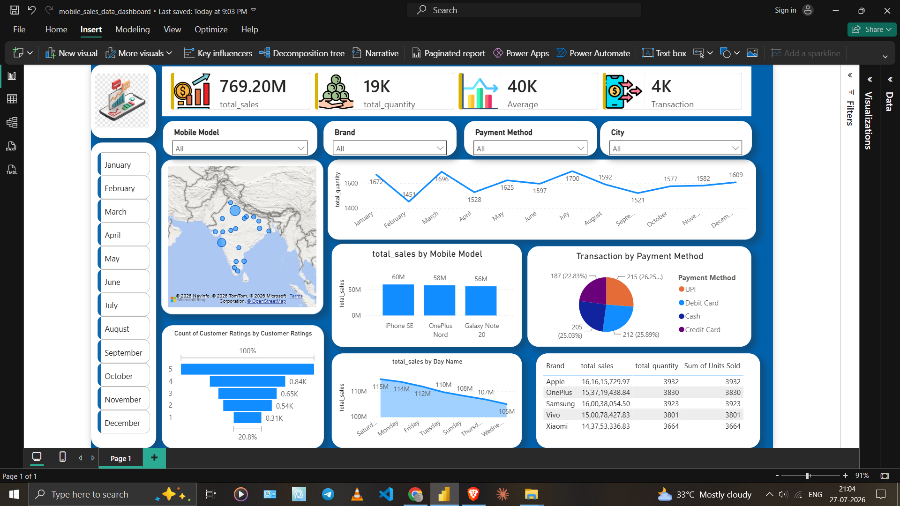

# 📱 Mobile Sales Dashboard | Power BI


## 📌 Project Overview

This project is an interactive **Mobile Sales Dashboard** built using **Microsoft Power BI**. It provides comprehensive insights into mobile phone sales across different cities, brands, models, payment methods, and time periods.

The dashboard enables users to analyze sales performance through dynamic filters, KPI cards, geographical visualization, and interactive charts.

---

## 📊 Dashboard Preview

### Main Dashboard

> Replace the image below with your uploaded screenshot.



---

## 🚀 Features

- 📈 Interactive KPI Cards
- 📅 Monthly Sales Analysis
- 📱 Mobile Model-wise Sales
- 🏷️ Brand-wise Performance
- 💳 Payment Method Analysis
- 🌍 City-wise Sales Map
- ⭐ Customer Rating Analysis
- 📅 Weekday Sales Trend
- 🔍 Interactive Slicers
  - Month
  - Mobile Model
  - Brand
  - Payment Method
  - City

---

## 📌 KPI Metrics

- **Total Sales**
- **Total Quantity Sold**
- **Average Sales**
- **Total Transactions**

---

## 📊 Dashboard Insights

### Sales Overview
- Displays overall business performance using KPI cards.
- Allows quick monitoring of revenue and transactions.

### Mobile Model Analysis
- Compare sales across different smartphone models.
- Identify the highest-selling devices.

### Payment Method Distribution
- Analyze customer payment preferences.
- Compare UPI, Cash, Debit Card, and Credit Card transactions.

### Customer Ratings
- Visualize customer satisfaction using rating distribution.

### Geographic Analysis
- Interactive map showing city-wise sales distribution.

### Daily Sales Trend
- Understand sales patterns across different weekdays.

---

## 🛠 Tools & Technologies

- Microsoft Power BI
- Power Query
- DAX
- Data Modeling
- Excel

---

## 📂 Project Structure

```
Mobile-Sales-Dashboard/
│
├── Mobile_Sales_Dashboard.pbix
├── README.md
├── dataset/
│   └── mobile_sales.csv
│
└── images/
    ├── dashboard.png
    ├── dashboard-filter1.png
    └── dashboard-filter2.png
```

---

## 📷 Dashboard Components

✔ KPI Cards

✔ Interactive Filters

✔ Map Visualization

✔ Line Chart

✔ Column Chart

✔ Pie Chart

✔ Funnel Chart

✔ Data Table

---

## 💡 Business Insights

- Compare sales performance across multiple smartphone brands.
- Monitor monthly sales trends.
- Identify the most popular payment methods.
- Discover top-performing cities.
- Analyze customer ratings.
- Compare mobile model performance.

---

## 🎯 Learning Outcomes

Through this project I learned:

- Data Cleaning using Power Query
- Data Modeling in Power BI
- DAX Measures
- Interactive Dashboard Design
- Slicers & Filters
- KPI Card Design
- Map Visualization
- Dashboard Layout & Formatting

---

## 👨‍💻 Author

**Zaheer Alam**

GitHub: https://github.com/zaheer-alam


---

## ⭐ If you like this project

Give this repository a ⭐ on GitHub.
